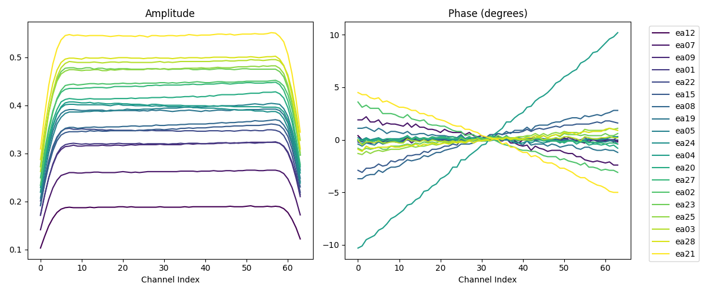

# calibration_pipeline

Simple Dockerized CASA (modular) pipeline to calibrate a VLA Measurement Set using `vla_basic_calibration.py`.

## 1) Get the example data

You need a VLA Measurement Set (.ms). The script has been exercised with the IRC+10216 X-band example (fields include `J1331+3030`, `J1229+0203`, `J0954+1743`, `IRC+10216`). If you already have a tarball like `day2_TDEM0003_10s_norx.tar.gz`, do:

```bash
mkdir -p data
cp /path/to/day2_TDEM0003_10s_norx.tar.gz ./data/
cd data
tar xf day2_TDEM0003_10s_norx.tar.gz
# This should create: day2_TDEM0003_10s_norx.ms/
cd ..
```

If you have a Measurement Set already, just place the `.ms` directory inside `./data`.

Download sources:
- Direct file: `http://casa.nrao.edu/Data/EVLA/IRC10216/day2_TDEM0003_10s_norx.tar.gz`
- NRAO Science Data Archive (search and download): `https://archive.nrao.edu` (or the new portal `https://data.nrao.edu/portal/`)
  - Tip: search for project or source name (e.g., IRC+10216) and export the MS or UVFITS, then convert to MS if needed.

## 2) Build the Docker image

The Docker image uses Ubuntu 24.04 and installs the CASA modular packages plus pre-populates `casadata` inside the image.

- Linux (x86_64) and Windows (WSL/WSA/Docker Desktop on Intel/AMD):
  ```bash
  docker build -t casa_test ./
  ```

- Apple Silicon or any arm64 host (needs amd64 emulation for CASA wheels):
  ```bash
  docker build --platform=linux/amd64 -t casa_test ./
  ```

## 3) Run the calibration

Mount your current working directory (so the container sees `./data`) and run the script. The image auto-activates the `casa` environment; we call the interpreter explicitly to be non-interactive.

```bash
# Linux/Windows on x86_64
docker run --rm -it \
  -v "$PWD":/workspace/data \
  -w /workspace \
  casa_test \
  micromamba run -p /opt/conda/envs/casa \
  python /workspace/vla_basic_calibration.py \
  --vis /workspace/data/data/day2_TDEM0003_10s_norx.ms

# Apple Silicon or arm64 host (add --platform)
docker run --rm -it \
  --platform=linux/amd64 \
  -v "$PWD":/workspace/data \
  -w /workspace \
  casa_test \
  micromamba run -p /opt/conda/envs/casa \
  python /workspace/vla_basic_calibration.py \
  --vis /workspace/data/data/day2_TDEM0003_10s_norx.ms

# Windows PowerShell tip: use ${PWD} instead of $PWD
# -v "${PWD}":/workspace/data
```

Notes:
- Adjust the `--vis` path if your `.ms` lives elsewhere under the mounted `./data` directory.
- Add the `--out_dir` argument to specify a different output directory (default is `/workspace/data/outputs` inside the container), wich maps to `./data/outputs` on the host.
- Add the `--out_file` argument to specify a different output HDF5 filename (default is `caltable_bandpass.hdf5`).

## 4) Outputs

- Calibrated target MS: `calibrated_target.ms` (written in the container working directory, i.e., `/workspace`).
- Raw bandpass calibration table generated by CASA: `caltable_bandpass.txt` (inside the specified output directory, default `/workspace/data/outputs`).
- Bandpass calibration dataset in HDF5 format: `caltable_bandpass.hdf5` (inside the specified output directory).
- Calibration plots (PNG file) inside the specified output directory. Complex calibration solutions vs frequency channel for each antenna.


Example of calibration plot generated by the pipeline.

## References

- CASA Modular Packages (installation guidance and versions): https://casadocs.readthedocs.io/en/stable/notebooks/introduction.html#Modular-Packages